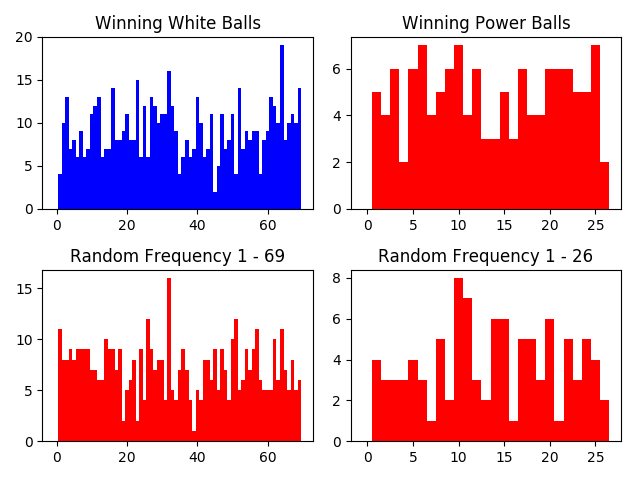

# PowerBall-SmartPick

Runs simple statistical analysison powerball picks dating back to 1992.
Displays the frequency of power ball picks in a histogram. Also displays histograms of randomly generated numbers to 
compare with.

Note that since the rule of the game are always subject to change, the URL to scrape from must be adjusted accordingly.

#### Usage

At a command prompt, run

```
python3 main.py
```

This should result in the creation of a window with 4 histograms like so:


